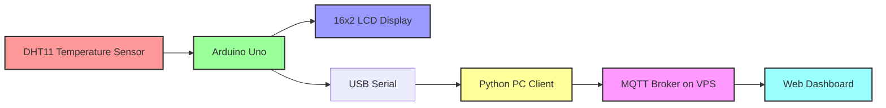

# System Architecture

## Overview

This system is a complete IoT temperature monitoring solution that reads temperature data from a DHT11 sensor, displays it locally on a 16×2 LCD, sends it to a PC via serial, publishes it to an MQTT broker on a VPS, and visualizes it using a web dashboard.

## Architecture Diagram

## Data Flow

1. **Sensor Reading**: The Arduino Uno reads temperature data from the DHT11 sensor every 2 seconds.
2. **Local Display**: The temperature and candidate name are displayed on the 16×2 LCD.
3. **Serial Communication**: Temperature values are transmitted to the PC via USB Serial (9600 baud).
4. **PC Processing**: The Python client reads serial data, validates it, and publishes it to MQTT.
5. **MQTT Broker**: The MQTT broker (Mosquitto) on the VPS receives and distributes messages.
6. **Dashboard Visualization**: The web dashboard subscribes to the MQTT topic via WebSocket and displays data in real time.

## Communication Protocols

| Link                    | Protocol                 | Details                              |
|-------------------------|--------------------------|--------------------------------------|
| Arduino ↔ LCD           | I2C                      | Address 0x27, SDA=A4, SCL=A5        |
| Arduino ↔ DHT11         | Single-wire digital      | Data pin D2                          |
| Arduino → PC            | USB Serial (UART)        | 9600 baud                            |
| PC → MQTT Broker        | MQTT v3.1.1 over TCP     | Port 1883, Topic: temperature/sensor |
| Dashboard → MQTT Broker | MQTT over WebSocket      | Port 9001, Topic: temperature/sensor |

## Component Responsibilities

### Arduino Uno
- Initialize LCD and DHT11 sensor
- Power DHT11 from digital pin D7
- Read temperature data every 2 seconds
- Display candidate name on Row 1 (with horizontal scrolling if > 16 chars)
- Display temperature on Row 2
- Transmit temperature values over serial

### Python PC Client
- Read data from serial port
- Validate temperature values
- Maintain MQTT connection (with auto-reconnect)
- Publish data to MQTT broker
- Display values in real time in the terminal
- Log all activities and errors

### MQTT Broker (Mosquitto)
- Receive messages from publishers
- Distribute messages to subscribers
- Support both TCP (port 1883) and WebSocket (port 9001)

### Web Dashboard (dashboard.html)
- Connect to MQTT broker via WebSocket
- Display current temperature with live updates
- Show high, low, and average statistics
- Render temperature gauge (0–50 °C)
- Plot temperature history chart (last 50 readings)
- Maintain live readings log with timestamps
- Configurable broker settings (saved in browser)
